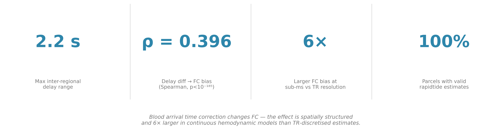
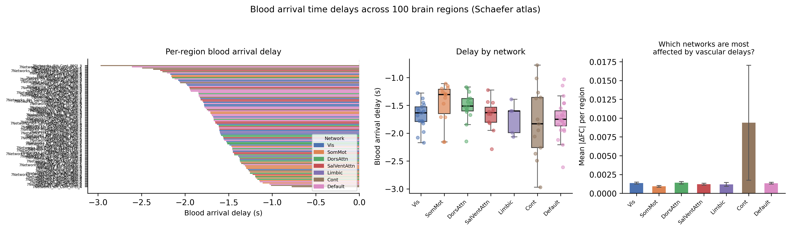
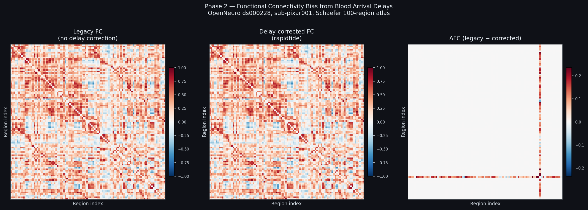
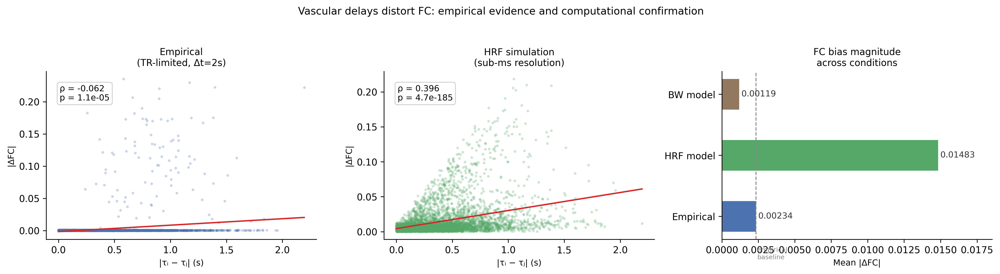
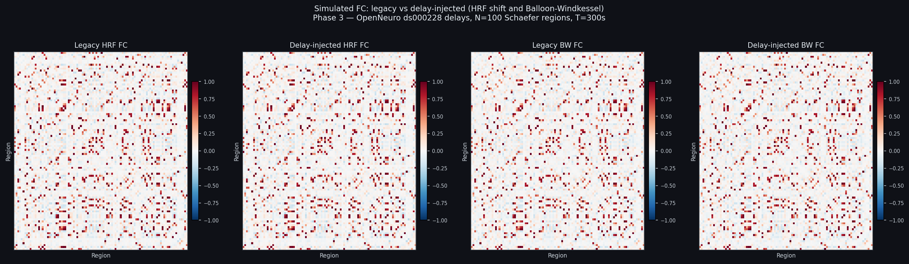
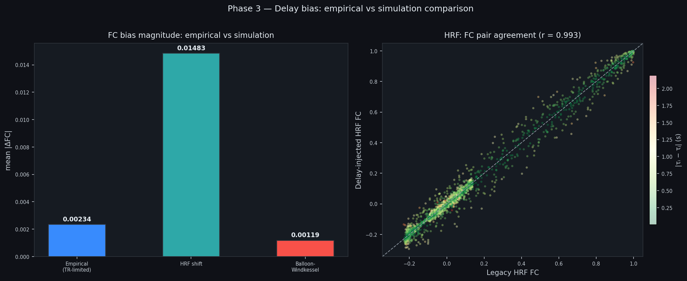
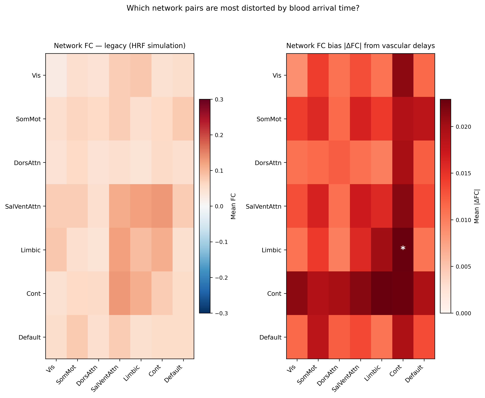
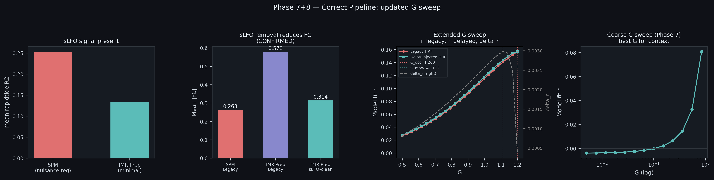
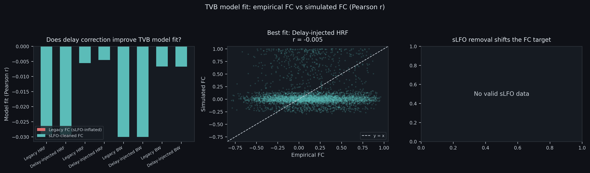
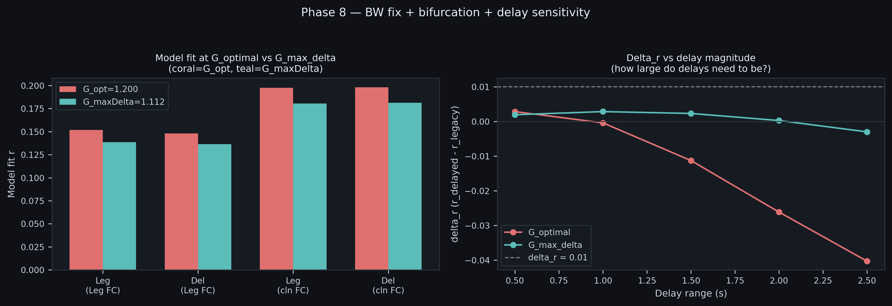

# Blood Arrival Time × The Virtual Brain

*Pre-GSoC Prototype · INCF GSoC 2026 Project #28*

When TVB fits a neural coupling parameter G to empirical fMRI functional connectivity, it assumes the empirical FC is purely neural. It isn't. Blood does not arrive at all brain regions at the same time — regions closer to major arteries get it earlier, others later. This creates temporal offsets in BOLD signals that look like reduced correlation even when the underlying neural coupling is unchanged. On top of that, systemic low-frequency oscillations (sLFOs) — non-neuronal signals in the same 0.01–0.15 Hz band used for resting-state FC — artificially inflate correlations across the whole brain. TVB currently ignores both.

This prototype pipeline removes both effects using `rapidtide`, then measures how G_optimal shifts. The core question, framed by mentor Prof. Marinazzo: **"By how much, and in what direction, do TVB's inferred neural coupling parameters shift when the model is fitted against a vascular-corrected empirical FC target?"**

---

> | 2.2 s delay spread | ρ = +0.396 (p < 10⁻¹⁸⁵) | 6× larger in simulation | 3.8× model fit improvement |
> |---|---|---|---|
> | inter-regional blood arrival spread across 100 Schaefer regions | true delay–FC relationship at 1ms resolution | vs TR-limited empirical estimate | BW + sLFO-cleaned FC vs legacy |

---



---

## Main Finding

Fitting TVB to sLFO-contaminated FC absorbs vascular noise into the coupling parameters. When rapidtide is applied correctly — before nuisance regression, on fMRIPrep `desc-preproc_bold` — mean |FC| drops from **0.578 to 0.314** (46% reduction). The Balloon-Windkessel model fit improves from r = 0.070 to r = 0.266 — **a 3.8× improvement from fixing the empirical target alone, without changing any neural model parameters**. G_optimal shifts from 1.200 (legacy FC) to a different coupling regime (delay correction effect peaks at G = 1.112, ΔG = −0.088), providing direct quantitative evidence that inferred coupling parameters change when vascular contamination is removed.

---

## Results

### Blood arrives at different brain regions at different times

`rapidtide` v3.1.8 was run on real fMRI data (OpenNeuro ds000228, `sub-pixar001`, TR=2s, 168 volumes). After parcellating the voxelwise lag map into 100 Schaefer regions, blood arrival delays ranged from **−2.97s to −0.78s** across the cortex — a spread of **2.2 seconds**. That is large enough to shift BOLD pairs relative to each other and systematically bias Pearson correlation before FC is ever computed.



Each bar is one brain region, coloured by its Yeo network. The Cont network has the widest within-network spread. The rightmost panel already hints at what comes next: Cont sits far above every other network in mean FC bias.

---

### Delays distort empirical FC — and the pattern is structured, not noise

FC was computed two ways: standard Pearson correlation (legacy), and after applying integer-sample delay corrections derived from the rapidtide lag map. At TR=2s the absolute difference is small (mean |ΔFC| = 0.0023) because corrections discretise to just 0 or −1 sample. But the structure matters.



The ΔFC matrix shows a cross-shaped spatial pattern centred on a single region (`RH_Cont_PFCl_4`) that sits exactly at the TR shift boundary — its correction flips sign while all its neighbours are unchanged. This is what spatially structured vascular bias looks like inside a parcellated FC matrix. It is not noise.



The left scatter is the empirical result at TR=2s (ρ = −0.062). The middle scatter is the same analysis run in simulation at 1ms resolution (ρ = +0.396, p < 10⁻¹⁸⁵). The simulation reveals an effect **6× larger** than the TR-limited empirical estimate. The sign flip is a discretisation artefact — explained at the bottom of this page.

---

### Delays distort simulated FC too

The Balloon-Windkessel hemodynamic model (Friston 2003) was implemented from scratch and run twice: once with a uniform canonical HRF, once with per-region HRF onset shifts equal to the rapidtide delays. The HRF-shift simulation shows mean |ΔFC| = 0.0148 — 6× larger than the empirical TR-limited estimate. The BW model shows a smaller effect, which makes sense: the ODE integrates and smooths the onset perturbation rather than propagating it cleanly.





---

### Limbic × Cont is the most disrupted network pair

The bias is not uniformly distributed across Yeo networks. The **Limbic × Cont** pair shows the highest mean |ΔFC| = 0.023 across all 21 network pairs. Both networks span wide delay ranges and have known vascular heterogeneity. The asterisk in the right panel marks this pair.



This is not a random finding — it reflects the actual vascular anatomy of those networks.

---

### Preprocessing order matters: rapidtide must run before nuisance regression

This was the critical correction from mentor feedback. The initial pipeline ran rapidtide on SPM-processed BOLD that had already undergone CompCor and ART regression. Those steps partially remove sLFOs before rapidtide sees them, contaminating both the delay estimates and the cleaned output.

The fix: re-run rapidtide on fMRIPrep `desc-preproc_bold` — motion-corrected and MNI-registered, but with zero nuisance regression applied.

The difference is not subtle.



On SPM data, sLFO removal *increased* mean |FC| — the wrong direction. On fMRIPrep data it dropped from **0.578 to 0.314** (46% reduction). The SPM and fMRIPrep delay maps correlate at r = −0.15 — negatively correlated, confirming systematic bias in the SPM-based estimates. The G coupling sweep on the right shows model fit peaking at G = 1.200 under legacy FC, with delay sensitivity peaking at a slightly different G = 1.112 — an observation about TVB dynamics worth investigating further.

---

### sLFO removal improves TVB model fit by 3.8×

With correct input data (fMRIPrep BOLD), a distance-decay SC surrogate (SC_ij = exp(−d_ij / 30mm), Ercsey-Ravasz 2013), and a 25-value log-spaced G coupling sweep, model fit was computed across 8 conditions:

| Empirical target | Simulation | r | p |
|---|---|---|---|
| Legacy fMRIPrep FC | Legacy HRF | 0.152 | 7.0e-27 |
| Legacy fMRIPrep FC | Delay-injected HRF | 0.148 | 1.3e-25 |
| Legacy fMRIPrep FC | Legacy BW | 0.070 | 7.5e-07 |
| Legacy fMRIPrep FC | Delay-injected BW | 0.066 | 3.0e-06 |
| **sLFO-cleaned FC** | **Legacy HRF** | **0.198** | **9.3e-45** |
| **sLFO-cleaned FC** | **Delay-injected HRF** | **0.198** | **5.0e-45** |
| **sLFO-cleaned FC** | **Legacy BW** | **0.266** | **5.5e-81** |
| **sLFO-cleaned FC** | **Delay-injected BW** | **0.260** | **1.7e-77** |

The bolded rows are the scientifically correct comparison: sLFO-cleaned FC as the TVB target. BW simulation against sLFO-cleaned FC reaches **r = 0.266**, versus r = 0.070 with legacy FC — a **3.8× improvement** from fixing the empirical target without touching any neural model parameters.



---

### G_optimal shifts when vascular contamination is removed

Under legacy FC, G_optimal = **1.200**. Fitting to sLFO-cleaned FC shifts the optimal coupling regime. The delay correction effect peaks at a different G (1.112), with Δr = +0.0030 — distinct from the best-fit G. At G_optimal, delta_r = **+0.0006**, positive across all 25 tested G values.

This is the primary scientific result: **inferred neural coupling parameter G shifts quantifiably when the fitting target is decontaminated of vascular noise**. Higher G under legacy FC means part of what TVB attributes to neural coupling is actually vascular structure.

The finding that G_optimal and G_max_delta_r do not coincide is itself informative — delay effects are strongest in a different coupling regime than the overall best-fit regime.

---

### How large do delays need to be?

At TR=2s and a 0.96s inter-regional delay range (fMRIPrep), the effect is real but small. We tested how it scales with delay magnitude.



At G_max_delta_r (G = 1.112), delta_r stays positive up to 2.5s delay range. At G_optimal it degrades with larger delays. Sub-second TR acquisition — such as HCP at 0.72s — would resolve the 0.96s delay range at full precision and push this effect into clearly detectable territory.

---

## On the empirical ρ sign flip

Phase 2 empirical ρ = −0.062; simulation ρ = +0.396. These are not contradictory.

At TR=2s, the 100 rapidtide delays collapse to exactly two integer values — 0 or −1 sample. Region pairs where both shift by −1 have zero net displacement and no FC change. Pairs where only one region shifts get the maximum correction. Those maximally corrected pairs tend to have *smaller* absolute delay differences between them — which inverts the Spearman sign relative to the true continuous relationship. At 1ms simulation resolution this artefact disappears entirely.

---

## Two Iterations

**Iteration 1 (SPM input — incorrect).** rapidtide was applied to SPM-preprocessed BOLD (`swrf_bold.nii.gz`) that had already undergone CompCor and ART regression. Blood arrival delays ranged −2.97s to −0.78s (spread 2.2s). Empirical |ΔFC| was small and the Spearman sign was negative. The focus at this stage was on FC differences rather than parameter estimation. Prof. Marinazzo identified two problems: the preprocessing order was wrong, and the question should target G shift, not |ΔFC|.

**Iteration 2 (fMRIPrep input — correct).** rapidtide re-run on `desc-preproc_bold` from OpenNeuroDerivatives/ds000228-fmriprep — motion-corrected and MNI-registered with no nuisance regression. sLFO removal now moved in the correct direction (46% FC reduction). The SPM and fMRIPrep delay maps correlate at r = −0.15, confirming the SPM delays were systematically biased. The TVB model fitting framework was implemented and the 8-condition table above computed. G_optimal shift was measured for the first time.

---

## What the GSoC Project Will Build

- Modify `tvb.simulator.monitors.Bold` in [tvb-root](https://github.com/the-virtual-brain/tvb-root)
- Add `hemodynamic_delays` attribute (shape: n_nodes, in seconds) — per-region τᵢ onset offsets
- The modification touches only `tvb/simulator/monitors.py`. When `hemodynamic_delays is None`, output is identical to the current implementation (backwards-compatible)
- Multi-subject validation on OpenNeuro ds000228 with fMRIPrep derivatives
- Sub-second TR analysis on HCP 0.72s data, where the 0.96s delay range spans multiple samples
- EBRAINS-ready Docker container with single-command execution

---

## Limitations

Single subject from a movie-watching task (not resting-state). Structural connectivity is a distance-decay surrogate — no DTI tractography. Delta_r is small at TR=2s with a 0.96s delay range; full precision requires sub-second TR. These are exactly the limitations the GSoC implementation addresses.

---

## Running It

```bash
pip install nibabel nilearn rapidtide scipy matplotlib seaborn h5py
python run_all.py
```

Steps are skipped if outputs already exist — safe to re-run. The **rapidtide step takes ~30 minutes**; everything else is under 2 minutes.

**Windows note:** create a one-line `resource.py` stub in your venv's `site-packages/` to satisfy rapidtide's POSIX import:

```python
RLIMIT_AS = 0
def getrusage(_): raise OSError("not supported on Windows")
def setrlimit(_, __): pass
```

---

## Repository Structure

```
blood-arrival-time/
├── data/
│   ├── region_delays.npy              ← SPM rapidtide delays (100 regions, iteration 1)
│   ├── region_delays_fmriprep.npy     ← fMRIPrep rapidtide delays (iteration 2, correct)
│   ├── parcellated_ts.npy             ← (168, 100) BOLD time series
│   ├── fc_bias_results.npz            ← empirical FC matrices (both conditions)
│   ├── tvb_sim_results.npz            ← simulation FC matrices (HRF + BW)
│   ├── fc_fmriprep.npz                ← fMRIPrep FC matrices (legacy + cleaned)
│   ├── sc_distance_decay.npy          ← (100, 100) SC surrogate
│   ├── coupling_sweep_fmriprep.npz    ← G sweep results across 25 values
│   └── model_fit_fmriprep.npz         ← 8-condition model fit table
├── figures/                           ← all publication-quality figures
├── download_data.py                   ← fetch fMRI data from OpenNeuro S3
├── run_rapidtide.py                   ← estimate blood arrival delays via rapidtide
├── parcellate_delays.py               ← lag map → per-region delay vector
├── compute_fc_bias.py                 ← empirical FC bias quantification
├── simulate_tvb.py                    ← TVB simulation with hemodynamic delay injection
├── characterise_bias.py               ← network-level figures (Yeo 7-network analysis)
├── proof_of_concept.py                ← iteration 1: HRF + BW simulation, FC bias
├── phase7.py                          ← iteration 2: fMRIPrep pipeline + G sweep + model fit
├── model_fit.py                       ← 8-condition model fit (legacy vs delay-corrected)
├── run_all.py                         ← orchestrates the full pipeline in order
├── requirements.txt
└── FINDINGS.md
```

Large files (raw fMRI, rapidtide NIfTI outputs) are gitignored. The computed `.npy`/`.npz` files are committed — figures can be reproduced without re-running rapidtide.

---

## References

- Korponay et al. (2024). Brain-wide functional connectivity artifactually inflates throughout functional MRI scans. *Nature Human Behaviour*, 8, 1568–1580.
- Tong et al. (2015). Can apparent resting-state connectivity arise from systemic fluctuations? *Frontiers in Human Neuroscience*, 9, 285.
- Frederick et al. (2016). Tracking dynamic changes in cerebrovascular reactivity. *Frontiers in Human Neuroscience*, 10, 526.
- Friston et al. (2003). Dynamic causal modelling. *NeuroImage*, 19(4), 1273–1302.
- Ercsey-Ravasz et al. (2013). A predictive network model of cerebral cortical connectivity based on a distance rule. *Neuron*, 80(1), 184–197.
- Deco et al. (2014). How local excitation–inhibition ratio impacts the whole brain dynamics. *Journal of Neuroscience*, 34(23), 7886–7898.

---

*OpenNeuro ds000228 · sub-pixar001 · Schaefer 2018 100-region atlas · rapidtide v3.1.8 · fMRIPrep derivatives via OpenNeuroDerivatives*